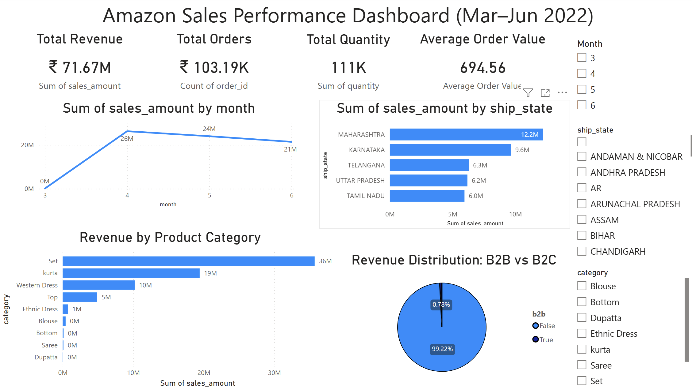
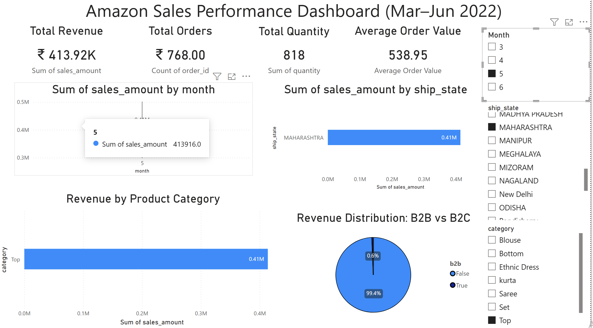

# 📊 Amazon Sales Analysis & Business Intelligence Dashboard

## 🔍 Project Overview

This project performs end-to-end sales analysis on Amazon e-commerce data using Python, SQL, and Power BI.  
The objective was to identify revenue drivers, regional performance patterns, customer purchasing behavior, and product-level insights.

---

## 🛠 Tools & Technologies Used

- **Python** – Data Cleaning & Feature Engineering
- **MySQL** – Data Analysis & Aggregation Queries
- **Power BI** – Interactive Business Intelligence Dashboard
- **Excel** – Validation & Exploratory Checks

---

## 📂 Project Workflow

1. Data Cleaning using Python (Pandas)
2. Database Creation & SQL Analysis in MySQL
3. KPI & Business Insight Extraction
4. Interactive Dashboard Development in Power BI
5. Executive-Level Visualization & Theme Customization

---

## 📈 Key Business Insights

- 💰 **Total Revenue:** ₹71.6M+
- 🛒 **Total Orders:** 103K+
- 📦 **Total Quantity Sold:** 111K+
- 💳 **Average Order Value:** ₹694

### 📊 Revenue Insights

- April was the highest performing month.
- Revenue declined in May and June, indicating possible seasonality.
- Maharashtra is the top revenue-generating state.
- South India contributes significantly to total revenue.
- Revenue is highly concentrated in **Set** and **Kurta** categories (~90% contribution).
- 99% of revenue comes from B2C customers.

---

## 📊 Dashboard Features

✔ KPI Overview (Revenue, Orders, AOV)  
✔ Monthly Revenue Trend  
✔ Top 5 Revenue-Generating States  
✔ Product Category Performance  
✔ B2B vs B2C Revenue Distribution  
✔ Interactive Filters (Month, State, Category)  

---

## 🖼 Dashboard Preview

### Executive Overview

### Filtered View Example

---

## 🧠 SQL Skills Demonstrated

- Aggregation (SUM, COUNT, DISTINCTCOUNT)
- GROUP BY analysis
- Window functions (LAG for growth calculation)
- Revenue segmentation analysis
- Ranking and Top-N filtering

---

## 🎯 Business Impact

This dashboard enables:

- Executive-level decision making
- Regional performance comparison
- Product category optimization
- Revenue trend monitoring
- Strategic growth opportunity identification

---

## 🚀 Future Improvements

- Add forecasting model
- Build customer segmentation analysis
- Implement profitability analysis
- Deploy dashboard to Power BI Service

---

## 👤 Author

Rahul Nandrajog  
MSc International Business (Advanced Research)  
Business Analytics & Data Visualization Enthusiast
